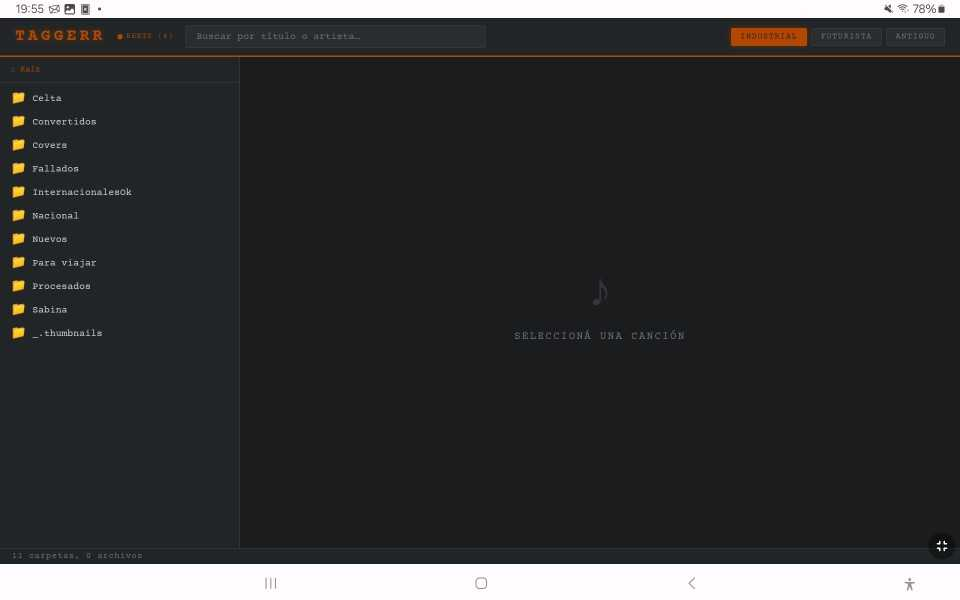
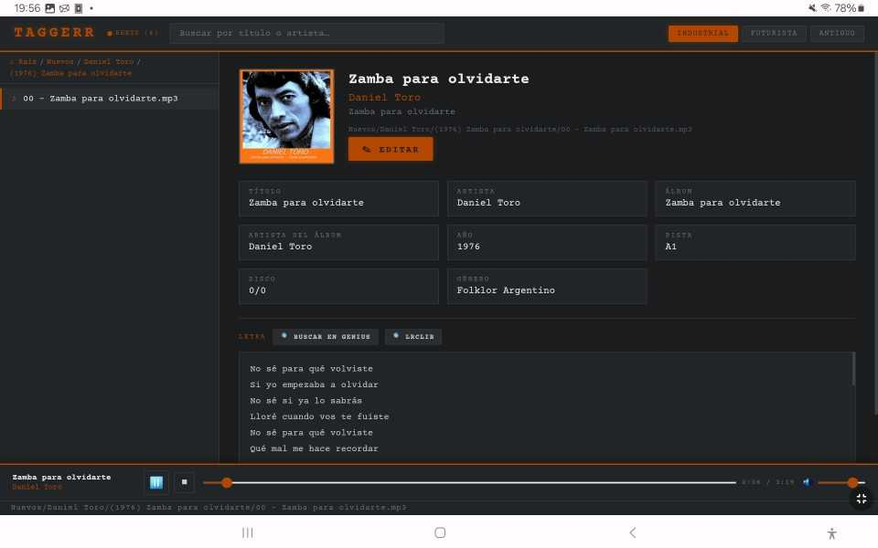
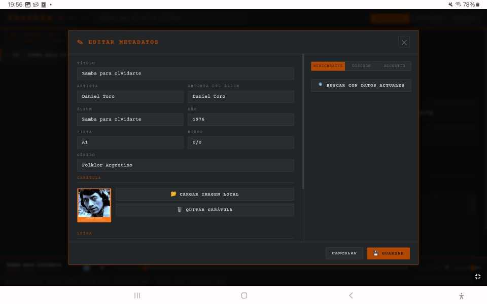

# Taggerr

Editor de metadatos de música basado en web, diseñado para entornos homelab. Permite editar los tags de archivos de audio directamente desde el browser, sin instalar nada en el cliente.

Pensado como complemento de [beets](https://beets.io/) — para corregir manualmente lo que la automatización no pudo resolver.

  

---






---

## Características

- **Edición de tags** — título, artista, álbum, año, pista, disco, género, carátula y letra
- **Búsqueda de metadata** en MusicBrainz, Discogs y AcoustID (identificación por huella de audio)
- **Búsqueda de letras** vía LRCLib (API pública, sin key)
- **Mini reproductor** integrado con seek y control de volumen
- **Tres temas visuales** — Industrial, Futurista, Antiguo
- **Indicador de beets** — muestra si la API web de beets está disponible
- **Responsive** — funciona en desktop y mobile

## Formatos soportados

`MP3` `FLAC` `OGG` `M4A` `Opus` `WAV` `AAC`

---

## Instalación

### Requisitos

- Docker y Docker Compose
- Una red Docker externa creada previamente
- API key de [AcoustID](https://acoustid.org/new-application) *(opcional)*
- Token de [Discogs](https://www.discogs.com/settings/developers) *(opcional)*
- 
Nota sobre ACOUSTID_API_KEY: se requiere registrar una aplicación en
https://acoustid.org/new-application (distinto de la key de usuario).

### Pasos

**1. Clonar el repositorio**

```bash
git clone https://github.com/osdaeg/taggerr.git
cd taggerr
```

**2. Crear el archivo de configuración**

```bash
cp .env.example .env
```

Editar `.env` con tus valores:

```env
MUSIC_DIR=/music
ART_DIR=/art
THEME=industrial

ACOUSTID_API_KEY=TuAPIKeyDeAcoustid
DISCOGS_TOKEN=TuTokenDeDiscoGS
BEETS_URL=http://beets:8337
```

**3. Crear el docker-compose.yml**

```bash
cp docker-compose.example.yml docker-compose.yml
```

Editar `docker-compose.yml` con tus rutas y red:

```yaml
services:
  taggerr:
    build: .
    container_name: taggerr
    ports:
      - "8499:8000"
    volumes:
      - /ruta/a/tu/musica:/music
      - /ruta/a/tu/carpeta/donde/descargas/caratulas:/art
      - /ruta/a/tu/config:/config
    env_file:
      - .env
    restart: unless-stopped
    networks:
      - TuRed

networks:
  TuRed:
    external: true
```

**4. Construir y levantar**

```bash
docker compose up -d --build
```

Acceder en `http://<IP_DEL_HOST>:8499`

---

## Uso

### Navegación
Usá el panel izquierdo para navegar por carpetas o buscar canciones por título o artista.

### Edición
Seleccioná una canción y hacé clic en **Editar**. El modal tiene:
- Formulario con todos los campos editables
- Gestión de carátula (cargar imagen local o desde Discogs)
- Campo de letra con búsqueda integrada en LRCLib
- Tabs de búsqueda: **MusicBrainz**, **Discogs**, **AcoustID**

### Reproductor
Al seleccionar una canción se activa el reproductor en la barra inferior.

---

## Variables de entorno

| Variable | Descripción | Requerida |
|---|---|---|
| `MUSIC_DIR` | Ruta interna de la música | Sí (no cambiar) |
| `ART_DIR` | Ruta interna de carátulas | Sí (no cambiar) |
| `THEME` | Tema por defecto (`industrial` / `futurista` / `antiguo`) | No |
| `ACOUSTID_API_KEY` | Key de aplicación de acoustid.org | No |
| `DISCOGS_TOKEN` | Token de usuario de discogs.com | No |
| `BEETS_URL` | URL de la API web de beets | No |

---

## API

| Método | Endpoint | Descripción |
|---|---|---|
| GET | `/api/browse` | Navega el árbol de directorios |
| GET | `/api/meta` | Lee metadatos de un archivo |
| POST | `/api/save` | Guarda metadatos en el archivo |
| GET | `/api/stream` | Streaming de audio (Range Requests) |
| GET | `/api/search/musicbrainz` | Búsqueda en MusicBrainz |
| GET | `/api/search/discogs` | Búsqueda en Discogs |
| GET | `/api/discogs/cover` | Proxy para carátulas de Discogs |
| GET | `/api/search/acoustid` | Identificación por huella de audio |
| GET | `/api/beets/status` | Estado de la API de beets |

---

## Stack

- **Backend** — Python 3.12, FastAPI, Mutagen, httpx
- **Frontend** — HTML5 / CSS3 / JavaScript vanilla
- **Infraestructura** — Docker, Docker Compose
