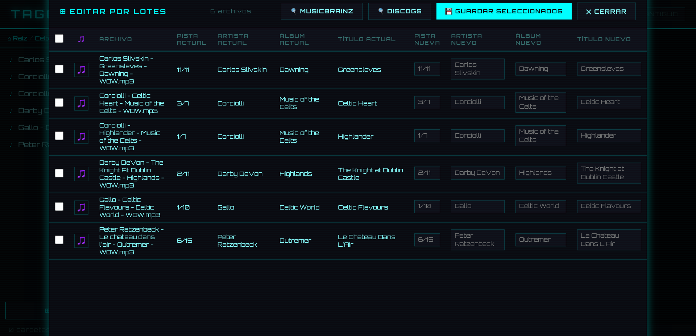

# Taggerr

Editor de metadatos de música basado en web, diseñado para entornos homelab. Permite editar los tags de archivos de audio directamente desde el browser, sin instalar nada en el cliente.

Pensado como complemento de [beets](https://beets.io/) — para corregir manualmente lo que la automatización no pudo resolver.

  

---




---

## Características

- **Edición de tags** — título, artista, álbum, año, pista, disco, género, carátula y letra
- **Edición por lotes** — corregí artista, álbum, pista y título en toda una carpeta de una vez
- **Búsqueda de metadata** en MusicBrainz, Discogs y AcoustID (identificación por huella de audio)
- **Búsqueda de letras** vía LRCLib (API pública, sin key)
- **Renombrado de archivos** por template configurable
- **Mini reproductor** integrado con seek y control de volumen
- **Tres temas visuales** — Industrial, Futurista, Antiguo
- **Indicador de beets** — muestra si la API web de beets está disponible
- **Responsive** — funciona en desktop y mobile

## Formatos soportados

`MP3` `FLAC` `OGG` `M4A` `Opus` `WAV` `AAC`

---

## Instalación

### Requisitos

- Docker y Docker Compose
- Una red Docker externa creada previamente
- API key de [AcoustID](https://acoustid.org/new-application) *(opcional)*
- Token de [Discogs](https://www.discogs.com/settings/developers) *(opcional)*

Nota: la API key de AcoustID requiere registrar una *aplicación* en acoustid.org, distinto de la key de usuario.

### Pasos

**1. Clonar el repositorio**

```bash
git clone https://github.com/osdaeg/taggerr.git
cd taggerr
```

**2. Crear el archivo de configuración**

```bash
cp .env.example .env
```

Editar `.env` con tus valores:

```env
MUSIC_DIR=/music
ART_DIR=/art
THEME=industrial

ACOUSTID_API_KEY=TuAPIKeyDeAcoustid
DISCOGS_TOKEN=TuTokenDeDiscoGS
BEETS_URL=http://beets:8337
RENAME_TEMPLATE={artist}/{album}/{track} - {title}
```

**3. Crear el docker-compose.yml**

```bash
cp docker-compose.example.yml docker-compose.yml
```

Editar `docker-compose.yml` con tus rutas y red:

```yaml
services:
  taggerr:
    build: .
    container_name: taggerr
    ports:
      - "8499:8000"
    volumes:
      - /ruta/a/tu/musica:/music
      - /ruta/a/tu/carpeta/donde/descargas/caratulas:/art
      - /ruta/a/tu/config:/config
    env_file:
      - .env
    restart: unless-stopped
    networks:
      - TuRed

networks:
  TuRed:
    external: true
```

**4. Construir y levantar**

```bash
docker compose up -d --build
```

Acceder en `http://<IP_DEL_HOST>:8499`

---

## Uso

### Navegación
Usá el panel izquierdo para navegar por carpetas o buscar canciones por título o artista.

### Edición individual
Seleccioná una canción y hacé clic en **Editar**. El modal tiene:
- Formulario con todos los campos editables
- Gestión de carátula (cargar imagen local o desde Discogs)
- Campo de letra con búsqueda integrada en LRCLib
- Tabs de búsqueda: **MusicBrainz**, **Discogs**, **AcoustID**
- Botones **Guardar** y **Guardar y renombrar**

### Edición por lotes
Hacé clic en **⊞ Editar por lotes** al pie del panel de archivos. Se abre un modal con todos los archivos de la carpeta actual (incluyendo subdirectorios) en una tabla:
- Columna izquierda: datos actuales (solo lectura)
- Columna derecha: datos nuevos (editables)
- **🔍 MusicBrainz** / **🔍 Discogs** — identifica todos los archivos en lote con barra de progreso
- **🎵** por renglón — identifica ese archivo con AcoustID
- Los renglones identificados se auto-seleccionan
- **💾 Guardar seleccionados** — guarda solo las filas marcadas, sin tocar el resto de los campos

### Renombrado de archivos
Al guardar con **Guardar y renombrar**, el archivo se mueve a la ruta definida por `RENAME_TEMPLATE` dentro de `MUSIC_DIR`. Etiquetas disponibles: `{artist}`, `{album}`, `{track}`, `{title}`, `{year}`. La extensión se agrega automáticamente.

Ejemplo:
```
RENAME_TEMPLATE=Nuevos/{artist}/{album}/{track} - {title}
```

### Reproductor
Al seleccionar una canción se activa el reproductor en la barra inferior.

---

## Variables de entorno

| Variable | Descripción | Requerida |
|---|---|---|
| `MUSIC_DIR` | Ruta interna de la música | Sí (no cambiar) |
| `ART_DIR` | Ruta interna de carátulas | Sí (no cambiar) |
| `THEME` | Tema por defecto (`industrial` / `futurista` / `antiguo`) | No |
| `ACOUSTID_API_KEY` | Key de aplicación de acoustid.org | No |
| `DISCOGS_TOKEN` | Token de usuario de discogs.com | No |
| `BEETS_URL` | URL de la API web de beets | No |
| `RENAME_TEMPLATE` | Template para renombrar archivos | No |

---

## API

| Método | Endpoint | Descripción |
|---|---|---|
| GET | `/api/browse` | Navega el árbol de directorios |
| GET | `/api/meta` | Lee metadatos de un archivo |
| POST | `/api/save` | Guarda metadatos en el archivo |
| POST | `/api/rename` | Renombra y mueve el archivo según el template |
| GET | `/api/stream` | Streaming de audio (Range Requests) |
| GET | `/api/search/musicbrainz` | Búsqueda en MusicBrainz |
| GET | `/api/search/discogs` | Búsqueda en Discogs |
| GET | `/api/discogs/cover` | Proxy para carátulas de Discogs |
| GET | `/api/search/acoustid` | Identificación por huella de audio |
| GET | `/api/beets/status` | Estado de la API de beets |
| GET | `/api/batch/files` | Lista recursiva de archivos con metadata |
| POST | `/api/batch/save` | Guarda metadata en múltiples archivos |
| GET | `/api/batch/search/musicbrainz` | Búsqueda MB para batch |
| GET | `/api/batch/search/discogs` | Búsqueda Discogs para batch |

---

## Integración con beets

Taggerr escribe los tags directamente en el archivo. Para mantener la base de datos de beets sincronizada, agregá `beet update` a tu script de importación:

```bash
beet import -q /import
beet update
```

El indicador **BEETS (N)** en el header muestra si la API web de beets está disponible y cuántos items tiene la biblioteca.

> La sincronización en tiempo real vía socket de Docker no está implementada por razones de seguridad.

---

## Mantenimiento

```bash
# Actualizar solo el frontend (sin rebuild)
# Reemplazar frontend/index.html y recargar el browser con Ctrl+Shift+R

# Actualizar backend
docker compose up -d --build

# Ver logs
docker logs taggerr

# Sincronizar beets manualmente
docker exec beets beet update
```

---

## Stack

- **Backend** — Python 3.12, FastAPI, Mutagen, httpx
- **Frontend** — HTML5 / CSS3 / JavaScript vanilla
- **Infraestructura** — Docker, Docker Compose
